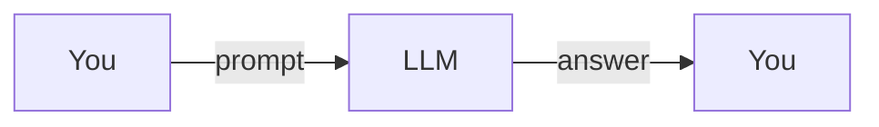
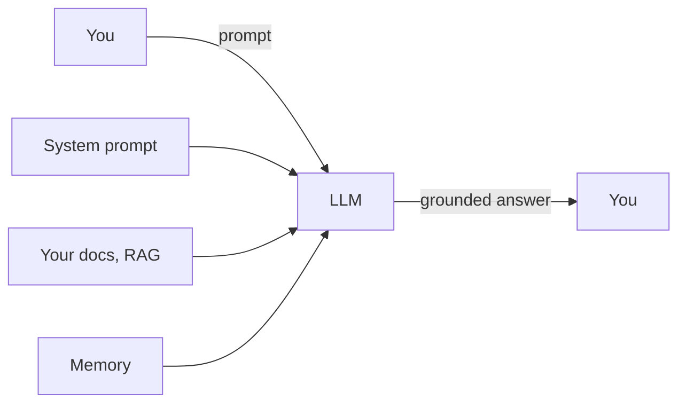
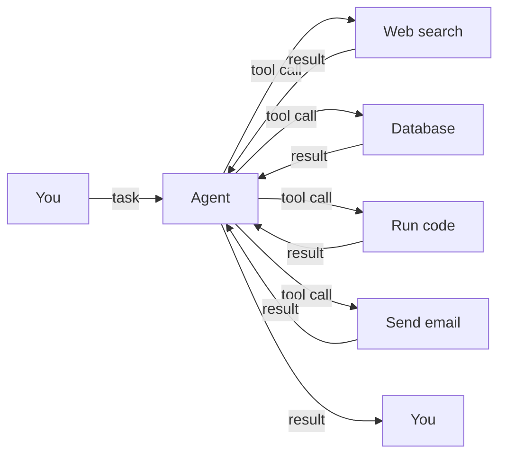
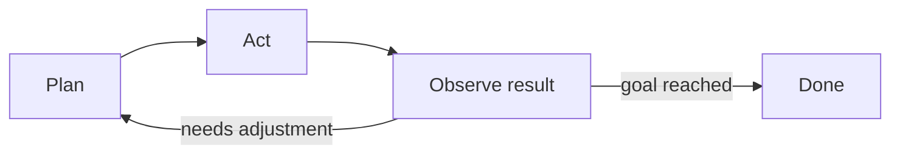
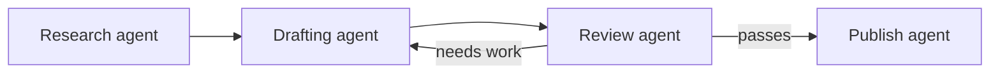

# Working with AI: Five Ways, From Prompts to Agent Graphs

*2026-07-31 · 6 min read · [ai] [prompt-engineering] [agents] [workflows] [beginner]*

Most people think working with AI means typing a good prompt. That's level one. There are at least five levels of working with AI, and each one gives you more control than the last. Here they are, from the simplest to the most powerful.

## Level 1: Prompt Engineering

**What it is:** the craft of asking well. The words you type into the box.

A prompt is more than a question. It carries context, constraints, examples, and a desired format. Compare these two:

> "Write a polite refusal."

> "Write a polite refusal to a client who just cancelled their contract. Three sentences. No apology for the delay, thank them for the years of collaboration."

Same intent, very different results. The second prompt tells the model who the audience is, how long the answer should be, and what to leave out.

**What it gets you:** better answers from a single request. That's it. No memory, no tools, no follow-up. One shot, one answer.

## Level 2: Context Engineering

**What it is:** controlling everything the model sees before it answers. The system prompt, the instructions, the documents, the conversation history, the search results.

Prompt engineering is asking the right question. Context engineering is deciding what's in the room when you ask it.

The most common example is RAG (retrieval-augmented generation). Instead of asking the model to answer from its training data, you let it look up your own notes, documentation, or database first, and answer from what it finds. The model becomes an assistant that reads your files before replying.

**What it gets you:** grounded, consistent answers that use your data. This is how customer support bots stop hallucinating product details: they read the manual first.

## Level 3: Harness Engineering

**What it is:** giving the AI hands. Tools, APIs, and actions it can call. Instead of just answering, it can do things.

Think of the model as a brain. The harness is the body you build around it: which tools exist, what they can touch, and what the guardrails are. This is where reliability comes from. You decide the boundaries, not the model.

Examples of harness pieces:

- Web search
- Database queries
- Sending emails
- Running code
- Reading and writing files
- Calling other APIs

My own setup lives at this level. My agent (Puck, yes I named it) has a terminal, a browser, file access, and messaging. It can check the BVG schedule, generate a dashboard image, push a blog post to GitHub, and send me the result on Telegram. That's a harness around a model.

**What it gets you:** AI that acts, not just talks.

## Level 4: Loop Engineering

**What it is:** building feedback cycles. The AI acts, observes the result, adjusts, and repeats. Instead of a single shot, you get a loop.

A chef tastes the sauce and adjusts it. Single-shot prompting is cooking without tasting. Loop engineering is the tasting step.

The most common pattern is plan-act-observe: the AI makes a plan, takes a step, looks at what happened, and decides what to do next. It's also called ReAct (reason + act). Related patterns:

- Self-correction: the AI reviews its own output and fixes mistakes
- Retry with more info: when a tool call fails, feed the error back and try again
- Evaluation loops: a second AI checks the first one's work before it ships

**What it gets you:** much harder problems solved, because the system can course-correct instead of hoping the first try was right.

## Level 5: Graph Engineering

**What it is:** wiring many AI steps, or many agents, together like a flowchart. Different parts do different jobs and hand their results to each other.

An assembly line instead of a single worker. One step researches, the next drafts, another checks quality, and a final step publishes. Each node in the graph is a focused piece, and the connections define how work flows between them.

Examples in the wild:

- A research agent that finds sources and passes them to a writing agent
- A review agent that checks the writing agent's work against a style guide
- n8n-style workflows with AI nodes in the middle
- Multi-agent systems built with tools like LangGraph

**What it gets you:** complex, robust pipelines that split work across specialized pieces. If one step fails, you know exactly which one, and you can fix or replace it without touching the rest.

## Which Level Should You Use?

| Your problem | Level |
|--------------|-------|
| Quick answer, one-off question | 1 |
| Answers must use your own data | 2 |
| The AI should take actions | 3 |
| Tasks where the first try often fails | 4 |
| A whole process with many moving parts | 5 |

Start at level 1 and add levels as the problem demands. There's no prize for using the most advanced level. The prize is solving the problem with the least complexity that works.

## A Personal Note

Everything on this blog now runs through levels 3 to 5. Puck has tools (harness), loops through steps until tasks are done (loop), and I run separate jobs for separate purposes: a weekly design job scan, a dashboard updater, a blog draft pipeline that opens pull requests for me to review (graph). I rarely type a raw prompt anymore. I engineer the context, the tools, and the loops around it.

## The Takeaway

Don't be impressed by people who "prompt well". The real craft is deciding what the AI sees, what it can touch, and how it learns from its own results. Prompts are the entrance. The levels above are where the actual work happens.

Start with prompts. Then work your way up one level at a time. Each level you add makes the AI more useful, and makes you think more like an engineer and less like a typist.
