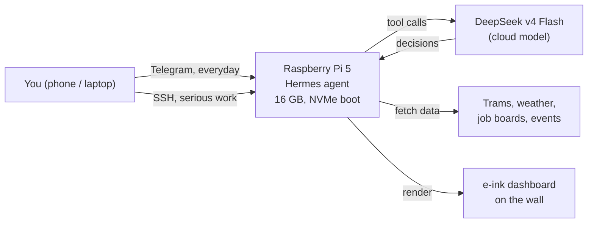

# My Raspberry Pi AI Agent: The Full Setup

*2026-08-02 · 6 min read · [raspberry-pi] [hermes] [ai-agents] [homelab] [nvme] [telegram]*

I run a personal AI agent from a Raspberry Pi 5 that sits in my living room in Berlin. It watches the tram schedule, updates an e-ink dashboard on my wall, scans job listings, drafts blog posts, and talks to me through Telegram. This post is the overview. If you want the step-by-step technical details, I wrote those up in a separate post: [Raspberry Pi 5 From Scratch](https://erikzocher.github.io/technology/2026/08/02/raspberry-pi-technical-deep-dive.html).

**The 30-second version:** a Pi 5 with 16 GB RAM, booting from a 1 TB NVMe SSD, runs an open source agent framework (Hermes) as an always-on daemon. The model itself lives in the cloud (DeepSeek), because local models on the Pi could not do tool calls reliably, and tool calls are what separate a chat from an agent. You talk to it over Telegram, fix it over SSH, and it runs a small fleet of scheduled jobs: trams, dashboards, job scans, blog drafts. Total cost: hardware once, single-digit euros per month for the model API, a few watts of power.

## The Hardware

**Raspberry Pi 5 Model B (Rev 1.1)** with **16GB RAM**. That matters: the Pi 5 is the first Pi where 16GB is an option, and for an always-on agent, the extra headroom is worth it.

The star of the show is the storage: a **1TB NVMe SSD** (BIWIN CE930) connected through the official **Raspberry Pi M.2 HAT+**. Booting from NVMe instead of an SD card changes everything. No more worrying about SD card corruption, which is the classic way a headless Pi dies. Reads and writes are fast enough that the agent never waits on disk.

A 238GB microSD is still in the slot from the old setup, but the system boots from the NVMe drive now. How I made that work is in the [technical post](https://erikzocher.github.io/technology/2026/08/02/raspberry-pi-technical-deep-dive.html).

## The OS

**Raspberry Pi OS, based on Debian 13 (Trixie)**, kernel 6.18. Running headless, no monitor, no keyboard. The only cables are power and network. Everything else happens over SSH and Telegram.

## The Agent: Hermes

The agent itself is [Hermes Agent](https://hermes-agent.nousresearch.com) by Nous Research. It is an open source AI agent framework that runs as a daemon on the Pi, and it is the whole point of this box. Instead of a chatbot that answers questions, Hermes is an agent that takes actions: it runs shell commands, reads and writes files, searches the web, manages scheduled jobs, and remembers things across sessions.

## Why a Cloud Model, Not a Local One

I used to run local models on the Pi, served by Ollama. I tried four of them over a few weeks:

| Model | Parameters | File size |
|-------|:----------:|:---------:|
| Gemma 4 (e2b) | 5.1B | 7.2 GB |
| Gemma 4 (64k context) | 5.1B | 7.2 GB |
| Gemma 4 (e4b) | 8.0B | 9.6 GB |
| Qwen 3.5 (9b) | 9.7B | 6.6 GB |

The size mattered, and the reason is the Pi's **16GB of RAM**. A model has to fit entirely in memory while the operating system, the agent, and everything else still need their share. The 5.1B models fit comfortably. The 8B and 9.7B models worked too, but they left much less headroom, and inference on CPU was slow: with no GPU, every token comes from the CPU, and the bigger the model, the longer you wait between words.

But the real reason I moved to the cloud was not speed or RAM. It was this: **none of them could do tool calls reliably.**

Tool calls are the difference between a chat and an agent. The model has to decide "I need the tram times" and produce a structured request to fetch them. Small models running on a Pi simply do not have the capacity for that reliably. They answer questions, but they cannot operate a harness. A local model on this hardware was a fun experiment and a dead end for real agent work.

So I switched to **DeepSeek v4 Flash** through the DeepSeek API. It is cheap, fast, and capable enough for tool use. The Pi sends requests to the API, the model decides what to do, and the Pi executes it. For this workload, cloud is the right call: the model lives in the cloud, the agent lives on the Pi, and the Pi stays quiet and cool.

## How I Interact With It

Two front doors, both headless:

**SSH** for everything serious. `ssh ezocher@192.168.178.54` gets me a shell, and from there I can reach the agent's files, logs, and configuration. When something breaks, this is where I look.

**Telegram** for everything daily. The agent is connected to Telegram as a bot, so I can message it like a friend. Ask for the tram, tell it to draft a blog post, ask it to check a job listing. It replies in the same chat. This is the interface that makes the whole thing feel alive. I check in from my phone, anywhere.

For the rare moments when I need a graphical interface, I use **Raspberry Pi Connect**, the Foundation's own remote desktop service. It works from any browser, no port forwarding needed. The setup steps are in the [technical post](https://erikzocher.github.io/technology/2026/08/02/raspberry-pi-technical-deep-dive.html).

## The Skills and Plugins That Make It Useful

Hermes organizes capabilities into skills, which are like plugins for the agent. These are the ones I actually use:

- **BVG tram departures**: checks the real tram times for my station (Buschallee). The most-used skill, honestly.
- **Kindle dashboard**: generates an e-ink dashboard image for an old Kindle Touch I mounted on the wall. Shows trams, weather, todos, and a Spanish word of the day.
- **Blog pipeline**: drafts posts and opens GitHub pull requests for me to review before anything goes live. This very post was drafted this way.
- **Berlin events**: scrapes event listings (rausgegangen.de and friends) for things to do.
- **Design job scan**: a weekly cron job that scans German design job boards. (For a friend, not me. I am a software engineer, not a designer.)
- **Humanize writing**: a checklist that keeps AI text from sounding like AI text.
- **Weather**: Open-Meteo, no API key needed.
- **Spanish tutor**: vocabulary and grammar drills, because I am learning Spanish.

The skills run on a schedule (cron) or on demand when I ask.

## What Runs Automatically

The Pi is a small fleet of always-on jobs:

- The Kindle wall dashboard refreshes every two minutes with trams, weather, and todos.
- A daily todo review at 20:00.
- A design job scan every Monday morning.
- Blog drafts that turn into pull requests for review.
- A real-time tram departure watcher.

Uptime at the time of writing: one week, two days, and counting. It just sits there and does its job.

## The Costs

- **Hardware**: Pi 5 16GB, NVMe HAT + 1TB SSD. One-time, roughly the price of a mid-range phone.
- **Power**: a few watts. Negligible on the electricity bill.
- **Model API**: DeepSeek v4 Flash is cheap. My usage costs single-digit euros per month.
- **Everything else**: free. Open source agent, free weather API, free job boards, Telegram bot is free.

## The Pattern, Reusable

The key decision was separating the model from the machine. The model is in the cloud where the compute is, the machine is at home where the actions are. If you want to build the same thing, the shape is simple:

1. **Put the agent where the actions are, the model where the compute is.** A Pi 5 is a terrible GPU server but a fantastic always-on host: silent, cheap, and strong enough to run the harness, the schedules, and the memory.
2. **Pick the front door for the audience.** Telegram for daily use, SSH for serious work, remote desktop for the rare graphical moment. Three interfaces, one agent.
3. **Test local models before committing to them.** I ran four Ollama models before concluding the bottleneck was tool calls, not speed. Small models answer questions; they struggle to operate a harness.
4. **Let the scheduled jobs do the proving.** A fleet of small cron jobs (trams, dashboard, job scans) turns the agent from a toy into something you rely on daily, and it costs nothing to run.

If you want a personal AI agent that actually does things instead of just talking, a Pi 5 with an NVMe drive and a cloud model is a really good place to start.

*Want the technical how-to? Read [Raspberry Pi 5 From Scratch](https://erikzocher.github.io/technology/2026/08/02/raspberry-pi-technical-deep-dive.html).*
