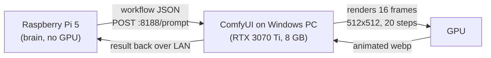

# My First AI Video: A Raspberry Pi, a Windows PC, and One Very Patient Cat

Every AI hobbyist reaches the moment where still images stop being enough. For me that moment was last week, when I realized my Raspberry Pi 5, for all its charms, will never render a video. Not one frame. The Pi is my always-on agent, my Telegram butler, my home automation brain. I wrote about [building it and its skills](https://erikzocher.github.io/technology/2026/08/02/raspberry-pi-ai-agent.html) a few days earlier. But AI video generation needs a GPU, and the Pi has none.

So I built a small Frankenstein: the Pi stays the brain, and a Windows PC with an NVIDIA RTX 3070 Ti became the muscle.

**The 30-second version:** I ran ComfyUI on a Windows PC with an RTX 3070 Ti and drove it remotely from my Raspberry Pi over the LAN. The Pi submits a workflow as JSON, the PC renders it on the GPU, and the result comes back. No cables, no cloud. The first video: 16 frames at 512x512, 20 steps, about a minute of render time. It is a wobbly two-tailed cat in a vaguely sunlit park, and it is the most satisfying minute I have spent on this hobby so far.

## The Setup

Two machines, one home network:

| Machine | Role | Hardware |
|---------|------|----------|
| Raspberry Pi 5 | Brain: runs Hermes, controls everything | 16 GB RAM, no GPU |
| Windows PC | Muscle: runs ComfyUI | RTX 3070 Ti (8 GB VRAM), 16 GB RAM |

The magic ingredient is the [ComfyUI API](https://www.comfy.org). ComfyUI, the node-based AI image and video tool, exposes a REST API. Any machine on the network can submit a workflow as JSON and pull back the result. The Pi talks to the PC over the LAN, no cables, no cloud.

## What We Did

Setting it up took longer than the actual generation, which is the classic pattern. Here is the path:

1. **Install ComfyUI on Windows.** The [Desktop app](https://www.comfy.org/download), with NVIDIA support selected. It was running with `--listen` so other machines could reach it.

2. **Find each other.** The Pi checks `http://192.168.178.22:8188/system_stats` and sees the GPU: an RTX 3070 Ti with 8.6 GB of VRAM.

3. **Pick a video model.** The full video models like [LTX-2.3](https://huggingface.co/Lightricks/LTX-2.3-fp8) or [Wan 2.1](https://huggingface.co/Wan-AI/Wan2.1-T2V-1.3B) are huge (20-30 GB) and need more VRAM than 8 GB. The pragmatic choice was [AnimateDiff](https://github.com/Kosinkadink/ComfyUI-AnimateDiff-Evolved): a motion module that animates existing Stable Diffusion models. Small, fast, and it works with the [DreamShaper](https://civitai.com/models/4384/dreamshaper) model I already had.

4. **Download the motion module.** A 1.7 GB file. This is where the setup got funny: ComfyUI's AnimateDiff version 1.6 looks for motion modules in a folder called `animatediff_models`, not the `motion_modules` folder that older tutorials mention. ComfyUI actually created the correct folder itself on restart. A quick `move` command and one more restart later, the module appeared.

5. **Build the workflow.** This is the part I love. A ComfyUI workflow is just a JSON graph: nodes and connections. I wrote one from the Pi with six nodes: the model loader, the AnimateDiff loader, the prompt encoders, the sampler, the VAE decoder, and the video saver.

6. **Submit and wait.** One `curl` POST later, the queue on the Windows PC started. The 3070 Ti rendered 16 frames at 512x512, 20 steps each, in about a minute.

## The Result

Here is the very first video my little cluster ever made. The prompt was "a cute cat walking through a sunlit park, cinematic lighting, high quality."

> **Note on sound:** this video is silent. AnimateDiff is a motion module on top of an image model, so it has no audio path at all. The LTX-2.3 model I later switched to is a joint audio-video model and can generate sound, but that is a separate project.

<video controls loop muted playsinline width="100%" style="max-width:512px; border-radius:8px;">
  <source src="/assets/videos/cat-park-animatediff.mp4" type="video/mp4">
  Your browser does not support the video tag.
</video>

It is not Hollywood. The cat drifts more than it walks, and the park is more suggestion than scenery. It also has two tails, because of course it does. When a diffusion model does not know how many tails a cat should have, it simply gives it the average number of tails, rounded up. Happy little accidents, as the painter would say: the cat was never supposed to have two tails, and I would not change it now. But consider what just happened: a text prompt typed on a tiny Linux board in Berlin traveled over WiFi to a Windows PC, became a latent-space dream on an NVIDIA GPU, and came back as sixteen frames of a cat in a park. The whole loop took about a minute.

**The run, in numbers:**

| Setting | Value |
|---------|-------|
| Model | DreamShaper + AnimateDiff v1.6 |
| Resolution | 512x512 |
| Frames | 16 |
| Steps | 20 |
| Render time | ~1 minute |
| VRAM used | 8 GB (fits comfortably) |

## Lessons Learned

- **VRAM is the currency.** 8 GB runs AnimateDiff comfortably at 512x512, 16 frames. LTX-2.3 (22B params) also fits in fp8, but bigger clips and higher resolutions are where 8 GB hits its ceiling.
- **Folder names change between versions.** The `animatediff_models` vs `motion_modules` confusion cost us two restarts. When a model is invisible, check the folder name the node actually scans.
- **Node names change too.** `EmptySDLatentImage` is now `EmptyLatentImage`, and the AnimateDiff loader changed from the simple apply node to `ADE_AnimateDiffLoaderWithContext`, which returns a model the sampler accepts directly.
- **The webp-to-mp4 conversion is easier on the machine that rendered it.** The Pi's ffmpeg could not decode the animated webp, so I extracted the frames with Python and reassembled them.
## What Is Next

The pipeline works. The Pi is now a remote control for a GPU that lives across the room. Next steps are tempting: longer clips, higher resolution, image-to-video, maybe that [LTX-2.3 model](https://huggingface.co/Lightricks/LTX-2.3-fp8) I downloaded and never got to use properly. If you want the full story of how the Pi itself is set up, from SSD boot to auto-starting services, I wrote that up in [Raspberry Pi 5 From Scratch](https://erikzocher.github.io/technology/2026/08/02/raspberry-pi-technical-deep-dive.html).

But for now, I have a cat. A slightly wobbly, vaguely sunlit, entirely machine-made cat. And that is a good place to start.

## The Pattern, Reusable

If you want to do the same thing, the shape is simple:

1. **Keep the brain and the muscle separate.** Your always-on machine stays the brain; the GPU box is a dumb renderer you reach over the network.
2. **Expose the muscle as an API, not a screen.** ComfyUI's REST endpoint turns "use a GPU" into a `curl` call. Anything that can speak HTTP can render.
3. **Start with the smallest model that fits your VRAM.** AnimateDiff on 8 GB beat the 20-30 GB video models I never could have run. The first win matters more than the ideal model.
4. **Expect the setup to take longer than the generation.** Folder names change, node names change, the first render is always an argument with the tool. The generation itself is the easy part.

The whole pattern: Pi thinks, PC renders, LAN connects, cat wobbles. Happy little accidents included.
