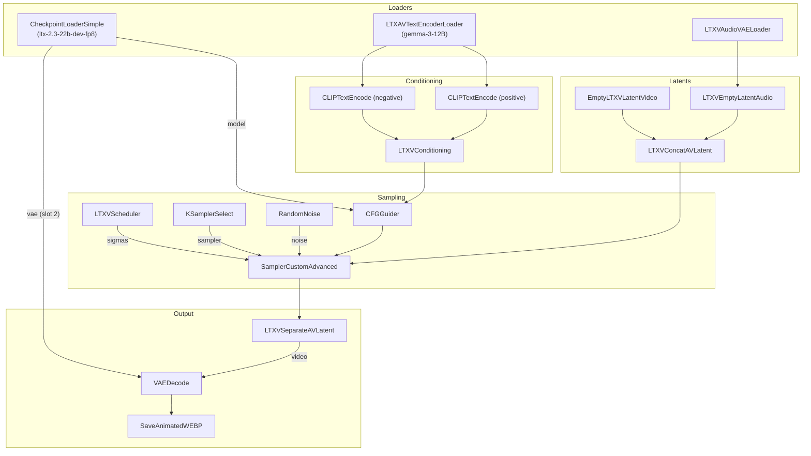

# How I Got LTX-2.3 Running in ComfyUI: Six Errors and a Lot of Patience

In my [last post](https://erikzocher.github.io/technology/2026/08/03/my-first-ai-video.html) I described how I turned my Raspberry Pi into a remote control for a Windows PC with an RTX 3070 Ti, generating a wobbly two-tailed cat video with AnimateDiff. The natural next step was to try a real video model. Not a motion module bolted onto an image model, but an actual text-to-video model: [LTX-2.3](https://huggingface.co/Lightricks/LTX-2.3-fp8), a 22B-parameter model from Lightricks that generates video and audio in one pass.

What followed was the most educational debugging session I have had in a while. Six distinct errors, each one hiding the next, each one teaching me something about how ComfyUI actually works under the hood.

## The Setup

Same hardware as last time:

| Machine | Role |
|---------|------|
| Raspberry Pi 5 | Brain: builds the workflow JSON, submits it via the ComfyUI API |
| Windows PC (RTX 3070 Ti, 8 GB VRAM) | Muscle: runs ComfyUI |

The model files: `ltx-2.3-22b-dev-fp8.safetensors` (22B params, fp8 quantized, 29 GB on disk), the Gemma text encoder, and the model's VAE.

**Quick primer: what is a VAE?** A VAE (Variational Autoencoder) is the translation layer between *pixels* and *latents*. Diffusion models do not work on images or videos directly: they work on a compressed, noisy mathematical representation called a latent space, which is much smaller than the actual pixels. The VAE has two halves: the **encoder** compresses pixels into latents (used for image-to-image and video-to-video), and the **decoder** expands latents back into visible pixels (used at the end of every generation). Think of it as the codec of the diffusion world: the model thinks and dreams in compressed form, and the VAE is what turns those dreams back into something you can see. Getting the wrong VAE is like connecting a Blu-ray player to a VHS-era TV: the signal is there, but nothing displays correctly.

## Error 1: "clip input is invalid: None"

The first submission failed immediately. LTX-2.3 does not bundle a text encoder inside its checkpoint, so the workflow tried to grab a CLIP model that was not there.

**Fix:** Load the text encoder separately. ComfyUI has a `CLIPLoader` node with a `type` parameter, and for LTX the correct value is `ltxv`, pointing at the Gemma encoder.

## Error 2: "Tensors must have same number of dimensions: got 4 and 3"

Now the model loaded, but the sampler exploded. This one took a while. The generic `CLIPLoader` produces text embeddings in a shape that LTX-2.3's video embedding connector cannot digest.

**Fix:** Use the node made for this exact purpose: `LTXAVTextEncoderLoader`. It knows how to pair the [Gemma text encoder](https://huggingface.co/google/gemma-3-12b-it) with the LTX checkpoint and produces embeddings the model accepts.

## Error 3: "'dict' object has no attribute 'sample'"

The workflow validated but crashed at runtime. My JSON embedded the sampler as an inline object instead of referencing a separate sampler node.

**Fix:** In the API format, every node must be a top-level entry, and connections use `["node_id", output_index]` references. The sampler got its own node, and the sampler node got a proper reference to it.

## Error 4: "expected input to have 16 channels, but got 128 channels"

This was the first clue about LTX-2.3's architecture. The VAE decoder expects 16 channels, but the sampler produced a latent with 128 channels. LTX-2.3 is a joint audio-video model: the latent contains both the video stream and the audio stream, interleaved.

**Fix:** Insert `LTXVSeparateAVLatent` between the sampler and the video decoder. It splits the joint latent into its video and audio halves.

## Error 5: "tuple index out of range"

The separator node complained it could not find the audio half. Right, because the workflow never created one. A joint AV model needs an audio latent to pair with the video latent, even when you only want the video.

**Fix:** Build the full audio chain: `LTXVAudioVAELoader` loads the audio VAE from the checkpoint, `LTXVEmptyLatentAudio` creates an empty audio latent, and `LTXVConcatAVLatent` merges the video and audio latents into the joint structure the sampler expects. After sampling, `LTXVSeparateAVLatent` splits them again.

## Error 6: the same 128-channel error, again

With the full AV chain in place, the sampler finally ran. The separator split the latent. And the decoder still choked on 128 channels.

The culprit was the VAE file itself. I had pointed the decoder at the separately downloaded `ae.safetensors`, which is LTX-2's VAE and expects 16 channels. LTX-2.3 is a different architecture with a 128-channel latent, and its VAE ships inside the checkpoint.

**Fix:** Take the VAE from the checkpoint loader's second output slot instead of loading a separate VAE file.

## The Working Recipe

The final workflow, for anyone who wants to skip the six hours of debugging. The LTX custom nodes come from the [ComfyUI-LTXVideo](https://github.com/Lightricks/ComfyUI-LTXVideo) repo, and the whole thing runs inside [ComfyUI](https://www.comfy.org):



Here is the result, 49 frames at 512x512, generated from the prompt "a cute orange cat walking through a sunlit park":

> **Note on sound:** this video is silent by design. The workflow creates an *empty audio latent* (`LTXVEmptyLatentAudio`) to satisfy LTX-2.3's joint audio-video architecture, and the output format (animated WebP, then converted to MP4) does not carry audio anyway. LTX-2.3 *can* generate sound when the audio path is conditioned properly, but that is a separate project.

<video controls loop muted playsinline width="100%" style="max-width:512px; border-radius:8px;">
  <source src="/assets/videos/ltx23-cat.mp4" type="video/mp4">
  Your browser does not support the video tag.
</video>

## Get the Workflow

The workflow is available as an editable template with a placeholder prompt, in two formats:

- For drag-and-drop into the ComfyUI canvas: [ltx23-t2v-template-ui.json](/assets/workflows/ltx23-t2v-template-ui.json)
- For the API: [ltx23-t2v-template.json](/assets/workflows/ltx23-t2v-template.json)

In the JSON, node `4` holds the prompt. Replace `REPLACE_WITH_YOUR_PROMPT` with your own text. For reference, the prompt that produced the cat video above was:

> *"a cute orange cat walking through a sunlit park, cinematic lighting, smooth motion, high quality"*

**Two ways to use it:**

1. **In the ComfyUI interface:** download the `-ui` JSON, then drag and drop it onto the ComfyUI canvas. The nodes appear, ready to run. Double-click node `4` to edit the prompt.
2. **Via the API (how I did it from the Pi):**
   ```bash
   curl -X POST http://<your-comfyui>:8188/prompt \
     -H "Content-Type: application/json" \
     -d '{"prompt": <workflow-json>, "client_id": "puck-pi"}'
   ```

**What you need installed:** the [ComfyUI-LTXVideo](https://github.com/Lightricks/ComfyUI-LTXVideo) custom nodes, the LTX-2.3 model in `models/checkpoints`, and the Gemma text encoder in `models/text_encoders`. The VAE comes from the checkpoint itself, no separate file needed.

## What I Learned

- **LTX-2.3 is not a video model with an audio add-on.** It is a joint audio-video model. The latent is one interleaved structure, and every stage of the pipeline has to respect that: audio latent creation, concatenation before sampling, separation after.
- **The right node matters more than the right parameter.** Every error here was about wiring, not about values. When a ComfyUI workflow fails in a strange way, question the node choice before the settings.
- **Checkpoints can carry their own VAE.** The separate VAE file in my models folder looked correct but was for the wrong model version. The VAE that matches the model lives inside the checkpoint.
- **8 GB of VRAM will run a 22B model, technically.** The render took over 20 minutes and the GPU utilization hovered around 10%. It works, but it is the slowest way to generate a two-second clip. For this model, 12-16 GB of VRAM is the honest minimum for comfortable use.
- **Debugging through an API is a great teacher.** Because I drove ComfyUI from the Pi over its REST API, I had to read every error message, check every node interface, and understand the graph end to end. No clicking around in a UI hoping something works.

The two-tailed cat from last time has a new cousin now. Same cat, same park, this one came from a real 22-billion-parameter video model, rendered at 24 frames per second, through six errors and one very patient Raspberry Pi.
