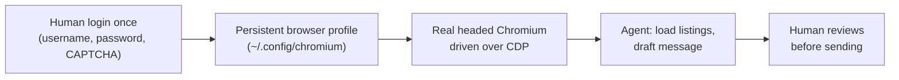

# I Gave an AI Agent Web Access. The CAPTCHA Was Not the Hard Part.

I wanted my Raspberry Pi agent to apply for apartments on [Immobilienscout24](https://www.immobilienscout24.de) by itself. Load the listing, check the details, contact the owner. I expected the CAPTCHA to be the obstacle. It was not. The real obstacle was understanding what the CAPTCHA is actually protecting: identity. Once I did, the solution stopped being about outsmarting bot detection and became a clean division of labor between a human and a machine.

**The 30-second version:** headless browsers, spoofed fingerprints, and virtual displays all got blocked within seconds. What worked was a real headed browser with a persistent profile, logged in once by a human over a remote desktop session, then driven by the agent over the DevTools protocol. The boundary that matters is human identity verification: the person proves who they are once, the agent reuses the result until the session expires. No CAPTCHA solving, no credential extraction, nothing against the site's terms.

## The Case Study: Immobilienscout24

I wanted my agent to contact apartment owners on Immobilienscout24. Sounds simple. It took three failed approaches and one working one.

| Approach | Browser mode | Profile state | Result | Time to failure |
|----------|--------------|---------------|--------|-----------------|
| Chrome DevTools MCP | Headless | Fresh | CAPTCHA on every page | Seconds |
| Browser Use + browserforge fingerprint | Headless, spoofed traits | Fresh | CAPTCHA | Seconds |
| Chromium on Xvfb | Headed, virtual display | Fresh | CAPTCHA | Seconds |
| Desktop Chromium via Raspberry Pi Connect | Headed, real desktop | Persistent, human-logged-in | Worked | n/a |

### Attempt 1: Chrome DevTools MCP

[Chrome DevTools MCP](https://github.com/ChromeDevTools/chrome-devtools-mcp) is designed to control and inspect a live Chrome browser. In my setup I drove it against a headless Chrome instance, and the result was an instant CAPTCHA: "Ich bin kein Roboter" on every page. Worth noting: the headless launch was my choice, not an inherent property of the MCP server, which can attach to a normal running browser too. The lesson stands either way: headless Chrome is exactly what bot detection is built to flag.

### Attempt 2: Browser Use + a spoofed fingerprint

Next I tried [Browser Use](https://github.com/browser-use/browser-use) with a crafted Windows Chrome fingerprint via [browserforge](https://github.com/daijro/browserforge), still headless. The idea was to spoof enough browser traits to pass. It changed nothing: CAPTCHA again within seconds. Fingerprint spoofing is a cat-and-mouse game, and the site's detection did not care what my headers claimed.

### Attempt 3: A headed browser on a virtual display

Maybe the problem was headless rendering itself. So I ran a real headed Chromium on a virtual display ([Xvfb](https://en.wikipedia.org/wiki/Xvfb)). Result: still CAPTCHA. Headed-vs-headless was not the deciding factor. Automation traces, session patterns, and IP reputation matter too.

### What actually worked

A real desktop Chromium with a persistent profile, logged in manually once, then driven over [CDP (Chrome DevTools Protocol)](https://chromedevtools.github.io/devtools-protocol/). It worked in my setup, and I can say exactly which conditions were in place: a normal browser in a normal desktop session, a persistent authenticated profile, and deliberate limits on what the agent does.

The login happened through [Raspberry Pi Connect](https://connect.raspberrypi.com), the Pi's built-in remote screen-sharing service. From any browser I can open connect.raspberrypi.com, pick my Pi, and see its desktop as if I were sitting in front of it. There I launched a normal Chromium window, went to Immobilienscout24, and authenticated as myself: username, password, and the CAPTCHA, all typed by a human in a real browser on a real desktop.

The key detail is where the cookies landed. That login wrote the session into Chromium's persistent profile (`~/.config/chromium`), the same profile the agent's browser uses. When the agent later starts Chromium with that profile and connects over CDP, it inherits the human-established session. No cookie theft, no token extraction, no replaying of credentials: authentication happened once, by a person, and everything after it reuses the result.

### The architecture, in one picture

The agent runs until the session expires or the site asks for renewed verification. Then the human steps in again.

## The Tools: Three Approaches to Web Access

For web access, I have learned about three approaches that are useful for interacting with webpages. Two are MCP servers, one is a browser automation framework, and the distinction matters:

| Approach | What it is | Best for |
|----------|-----------|----------|
| **[Chrome DevTools MCP](https://github.com/ChromeDevTools/chrome-devtools-mcp)** | MCP server; controls and inspects a live Chrome browser via CDP | Clicking, form filling, debugging, persistent sessions |
| **[Hound MCP](https://github.com/dondai1234/master-fetch)** | MCP server; fetches and extracts text with automatic escalation | Reading content quickly, search, PDFs |
| **[Browser Use](https://github.com/browser-use/browser-use)** | Browser automation library and agent platform with MCP integration | Scripted browsing, scraping, multi-step flows |

### What is an MCP anyway?

MCP ([Model Context Protocol](https://modelcontextprotocol.io)) is a standard way for AI agents to plug into tools. Instead of every agent inventing its own way to talk to every service, an MCP server exposes a common interface. That interface can wrap all kinds of capabilities: browsers, API endpoints, databases, file systems, developer tools. This post focuses on the web-related ones, but the protocol is not limited to browsers.

The easiest way to think about it: **the LLM is the brain, and MCP servers are the hands.** The brain alone cannot touch anything: it cannot open a website, click a button, or read a PDF. The hands reach out to third-party sources, fetch data, and bring results back. The brain decides, the hands do. What makes it practical is the MCP host: it discovers what each server can do, coordinates access, and hands the relevant tool definitions to the model.

### Can they solve CAPTCHAs?

The question everyone asks first. Some offerings in this space advertise CAPTCHA solving, including hosted plans of tools like Browser Use and Hound. I did not pursue that path. Such services are unreliable, can run contrary to a site's terms, and risk getting the account flagged. The approach in this post needs no CAPTCHA solving at all, which is exactly why it stays on the right side of the line.

## The Honest Truth About Anti-Bot Systems

Every serious website now runs bot detection: [Imperva](https://www.imperva.com), [Cloudflare](https://www.cloudflare.com), [reCAPTCHA](https://www.google.com/recaptcha/about/), [PerimeterX](https://www.perimeterx.com). These systems check far more than "does this look like a browser?":

- Headless vs. headed rendering
- WebDriver flags and automation fingerprints
- IP reputation
- Cookie and session consistency
- Mouse movement and timing patterns

The lesson I wish I had read before spending an evening on it: **no tool choice by itself gets you past this.** What survived was not a stealthier browser but a boundary that removed the need to be stealthy at all.

## Safety Box

Wherever you draw your own boundary, these rules keep you out of trouble:

- **No credential extraction.** The agent never handles passwords or tokens.
- **No CAPTCHA bypassing.** A human solves the CAPTCHA, once, at login.
- **Rate-limit requests.** The agent checks every ten minutes, not every second.
- **Review messages before sending.** A human approves what goes out.
- **Stop when asked.** If the site asks for verification again, stop and let a human take over.

Each site's terms, rate limits, consent rules, and anti-spam policy decide what is acceptable. Reading and following them is part of the job.

## A Reusable Framework

The pattern here is bigger than one apartment site. For any site you want to automate, identify three things:

1. **Identity-establishing steps** (login, verification, the things only a person should do): keep these human.
2. **Explicitly permitted repeatable steps** (reading listings, checking status, drafting within the site's rules): automate these.
3. **Required human approvals** (sending a message, publishing, anything irreversible): keep these in the loop.

My agent now checks Immobilienscout24 every ten minutes, reads new listings, and drafts contact messages. The human input is the login that happens when the session expires, and the review before anything is sent. That boundary is not a compromise. It is the right shape for automation that stays honest: a human at the door, an agent everywhere else.
