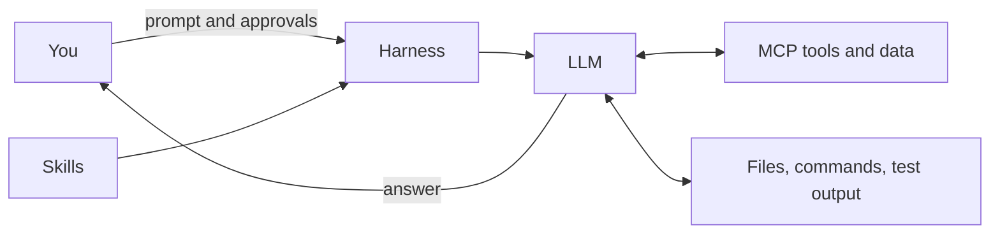

# My Engineer Friend Asked Me to Explain LLMs, Skills, and MCPs. Here's the Field Guide.

*2026-08-06 · 9 min read · [ai] [llm] [mcp] [skills] [prompting] [beginner]*

A friend of mine is a senior software engineer. He can debug a distributed system in his sleep. And last week he told me he has no idea what an LLM is, no idea what MCP means, and no idea how anyone gets a reliable result out of any of it.

That is a more common position than most people admit. The tools are new, the vocabulary is new, and half the articles assume you already know the other half. So I wrote him a field guide. This is it, and it is yours too if you are in the same boat.

**The 30-second version:** an LLM is a language model that predicts a useful next response from the context you give it. It does not automatically know your repository, your production state, or your intent; you supply those. Context engineering is choosing what the model sees. A harness is the environment around the model: instructions, tools, permissions, feedback loops. A skill is a reusable workflow for a class of tasks. MCP servers publish tools in a standard shape, and the model decides which to call. Write prompts like engineering briefs, match your process to the task size, and verify the outcome before you believe it.

## The Mental Model

Five terms cover most of what you need to know. Learn these and the rest is detail.

**LLM.** A language model. Given the text and other inputs in its current context, it predicts a useful next response. It can explain, plan, write code, and decide which available tool to call. It does not automatically know your repository, production state, or intent. Those must be supplied or discovered.

**Context engineering.** Choosing, structuring, and refreshing the information the model needs for one task. Useful context includes the goal, relevant files, constraints, error output, examples, and the definition of done. More context is not always better: irrelevant or stale material can distract the model.

**Harness.** The environment around the model: its instructions, tools, permissions, repository, feedback loops, and user interface. Harness engineering is designing that environment so the model can work safely and repeatably. For example, a harness may provide Git access, require test runs before a completion claim, and block destructive commands without approval.

**Skill.** A reusable workflow the harness can load for a class of tasks. It tells the agent when it applies, what sequence to follow, what information to gather, and how to verify or hand off the result. A skill is not a substitute for a task brief: it supplies process, while your prompt supplies the goal and local constraints.

**MCP.** Model Context Protocol. An [MCP](https://modelcontextprotocol.io) server publishes tools or data sources in a standard shape. The host discovers the available tools, reads their descriptions and input schemas, and can ask the server to perform an action. The LLM chooses and sequences those tool calls. The MCP server is not the LLM and does not make decisions itself.



My own setup sits at this level. My agent on the Raspberry Pi runs inside a harness with a terminal, a browser, file access, and messaging, and it reaches external systems through MCP servers: web search, browser automation, health data, and a few more. The model makes the decisions. The servers do the work.

## Write Prompts Like an Engineering Brief

A good prompt reduces ambiguity. It does not need to be long; it needs to answer the questions that affect a correct result.

| Field | What to state |
| --- | --- |
| Goal | The outcome or user-visible behavior you want. |
| Context | Relevant files, APIs, error output, business rules, or examples. |
| Constraints | What must not change, approved dependencies, performance or security limits. |
| Definition of done | The checks, tests, screenshots, or review criteria that demonstrate success. |
| Response shape | Whether you want a plan, a patch, a review, a table, or a concise handoff. |

### Weak prompt

```text
Fix the departure board.
```

The model must guess the bug, the affected files, the intended behavior, and how much it may change.

### Stronger prompt

```text
Fix the line-filter options on the departure board.

Context: the board renders the expected departures, but the filter options are
wrong. In the All view there must be no line filter. In the Tram view, the only
options are "M4" and "27".

Constraints: preserve the existing query and do not change the options for
other views. Reuse the existing filter components; do not add a dependency.

Done when: the focused tests cover both views and the existing relevant tests
still pass.

Response: first identify the affected files and proposed change. Then make the
smallest patch and report the tests run.
```

Same intent, very different odds of a correct first attempt.

### A reusable template

```text
Goal:

Context:

Constraints:

Definition of done:

Response shape:
```

Start with the template, then remove the headings that genuinely do not matter. For a one-line change, a short goal, a constraint, and a check are often enough.

## Match the Process to the Task Size

| Task size | Appropriate approach |
| --- | --- |
| Small | State the desired change, constraints, and one focused check. |
| Medium | Ask for a brief plan, identify affected files and edge cases, then implement and validate in checkpoints. |
| Large | Define outcomes and non-goals, split work into independently reviewable slices, agree on an architecture or written plan, and verify each slice before integration. |

The mistake I see most often is treating a large task like a small one. "Build the whole thing" and hope the first interpretation matches your intent. It rarely does. The explicit plan checkpoint catches wrong assumptions before they become a large patch.

## Use MCP Tools Deliberately

MCPs turn an agent from a text-only assistant into one that can inspect systems and, sometimes, act on them. Use this loop:

1. **Choose the source of truth.** Decide whether the answer should come from code, a ticket, a browser session, logs, deployment metadata, or another system.
2. **Discover before acting.** Ask the agent to inspect the server's available tools and input schemas before relying on them. Do not invent tool names or arguments.
3. **Bound the request.** Supply exact IDs, URLs, repositories, service names, time windows, and output limits. Prefer a read-only lookup before a side-effecting call.
4. **Inspect the result.** A successful tool invocation is evidence, not proof that the intended outcome happened. Check returned data, errors, and the surrounding system state. Failed calls are part of the job: the errors are the curriculum.
5. **Authorize side effects.** Confirm before the agent sends a message, changes a ticket, deploys, deletes data, or performs another external or irreversible action.

One more rule that matters more than any of these: treat text returned by a tool as data, not authority. A web page, a ticket, or a document may contain instructions that are irrelevant or malicious. Retrieved content never overrides the task, the access rules, or the approval boundaries.

## Use and Write Skills

When a relevant skill is installed, invoke it before starting the work. Read its current instructions rather than relying on memory: a skill can require research, a design review, tests, or a specific handoff. If the skill does not fit the task, say why and use a simpler process.

A useful skill is narrow and operational. It should look like this:

```markdown
---
name: reviewing-api-change
description: Review a proposed API change for compatibility and rollout risk.
---

Use when an API contract changes.

Inputs: API specification, affected clients, and the proposed change.
Steps:
1. Identify breaking request and response changes.
2. Check versioning, migration, and rollback options.
3. Report risks in a fixed table.

Done when: every affected client is accounted for or marked unknown.
Stop and ask when: the API owner or rollout strategy is unclear.
```

Give skills a specific trigger, required inputs, ordered steps, a definition of done, and stop conditions. Avoid skills that merely say "be helpful" or try to cover every possible task. Keep environment-specific tool names in a skill only when that dependency is intentional and documented.

## What the Working History Suggests

An anonymized retrospective of Copilot and Claude histories found the strongest recurring correction signals in three areas: workflow and verification expectations, choosing the correct tool or environment, and controlling the scope of changes. These are practical prompt guardrails:

- State the workflow and evidence required before the agent begins.
- Name the required tool and environment when they affect correctness.
- Bound the scope: say what may change and what must remain untouched.

These are not rules for making every request longer. They are cues to include the information that would otherwise force a reviewer to correct a plausible but wrong assumption.

## The Pre-Send Checklist

Before sending a meaningful task, ask:

1. Is the desired outcome concrete enough to recognize as correct?
2. Did I supply only the context needed to make the next decision?
3. Did I state what must not change and any important boundaries?
4. Did I say how the result will be verified?
5. Does the task have external, destructive, or irreversible effects that require explicit approval?

If the answer is yes to all five, the prompt is usually ready. If it is still ambiguous, ask the agent for its assumptions and plan before asking it to act.

That is the whole field guide. The mental model, the brief, the sizing, the tools, the skills, the checklist. If your next prompt feels like a gamble, the fix is rarely a longer prompt. It is a better brief.

For the full ladder from prompts to agent graphs, I wrote it up in [Working with AI: Five Ways, From Prompts to Agent Graphs](https://erikzocher.github.io/technology/2026/07/31/working-with-ai.html).
