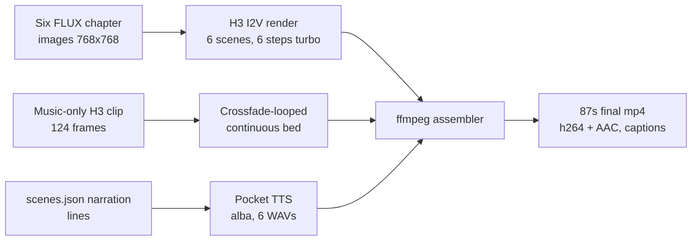

# I Animated My Blog Post with a 42 GB Video Model. Here's the Pipeline and Everything That Broke

*2026-09-04 · 15 min read · [comfyui] [ai] [video] [image-to-video] [debugging] [dgx-spark]*

Two months ago I published [The Case of the Slain Gateway](/technology/2026/08/02/the-case-of-the-slain-gateway.html), a debugging story about my headless Raspberry Pi, told as a Sherlock Holmes mystery and illustrated with six FLUX chapter images. The images were good, but they were still. So I turned them into a film: an 87 second animated explainer where each chapter's illustration breathes, a narrator reads the case, and a continuous Victorian score runs underneath. Everything rendered locally on my [DGX Spark](/technology/2026/08/25/i-bought-a-dgx-spark.html), a laptop with a GB10 chip and 128 GB of unified memory.

<video controls playsinline width="100%" style="max-width:768px; border-radius:8px;">
  <source src="/assets/videos/2026-09-04-animating-a-blog-post/slain-gateway-explainer.mp4" type="video/mp4">
  Your browser does not support the video tag.
</video>

> **AI disclosure:** This video is generated with MiniMax H3 (image-to-video) from the post's own FLUX illustrations. The narration is synthesized with Pocket TTS. Both were made by me on my own hardware.

**30 second summary, for the skimmers:**

- **Model:** MiniMax H3, a joint audio-video generation model, 42 GB across five files, running in ComfyUI on the DGX Spark. No cloud, no API keys.
- **Consistency trick:** every scene is an image-to-video (I2V) render from the post's own chapter illustration, with the prompt explicitly telling the model to preserve faces and clothing. The first frame of each scene measures 30 to 34 dB of PSNR against the source image, which means the illustration is effectively still there, just moving.
- **Sampling:** 6 steps with a turbo LoRA, `res_multistep` sampler, `simple` scheduler, 1344x768 at 24 fps. Scene length snaps to the model's 17k+5 frame grid, 124 to 362 frames (about 5.2 to 15.1 seconds).
- **Audio:** three layers mixed with ffmpeg. A Pocket TTS narration (voice: alba) at full volume, a continuous music bed at 40%, and each scene's own generated ambience at 12% as texture. Captions are burned in from the narration script, not from speech recognition.
- **Cost in time:** about 4.2 hours of wall time for six scenes. Steady state was 27 to 43 minutes per scene.
- **What broke:** a kernel OOM that killed ComfyUI mid-batch, music that restarted at every scene boundary, frozen scene tails in the first cut, and an ffmpeg filter graph that refused to link. All four solved, all four in this post.

## The pipeline in one picture



The whole thing is data-driven: one `scenes.json` file holds the six chapters, each with its image, its narration line, its motion description, and its target length. Every script reads that file. Change one line of JSON and the next run picks it up.

## The model, and why it fits in a laptop

MiniMax H3 generates video and audio together from a single latent. That is the detail that matters here: it is not a video model with a soundtrack bolted on, the audio is part of the generation. H3's audio is what created both my biggest headache (more on that later) and my cleanest solution.

The five files, and what each one is:

| File | Size | What it is |
|---|---|---|
| `minimax_h3_fl2va_pruned_int8_convrot.safetensors` | 20 GB | The UNet (the model's core: it steps a noisy latent toward a clean one). Pruned and quantized to int8, which is what makes it runnable on 128 GB unified memory instead of a multi-GPU box |
| `qwen3vl_32b_minimax_h3_nvfp4_awq.safetensors` | 15 GB | The text encoder: a 32B Qwen vision-language model in 4-bit (nvfp4 + AWQ quantization). It reads your prompt and turns it into conditioning for the UNet |
| `minimax_h3_video_vae_fp16.safetensors` | 4.9 GB | The video VAE. A VAE is the codec of the diffusion world: the model dreams in a compressed latent space, and the VAE turns the dreams back into pixels |
| `minimax_h3_audio_vae_fp32.safetensors` | 0.6 GB | The audio VAE, same idea for the sound track |
| `minimax_h3_fl2v_turbo_8step_v1.0_comfyui_bf16.safetensors` | 1.9 GB | A turbo LoRA. A LoRA is a small set of extra weights that steer a big model, here teaching it to finish in 6 to 8 steps instead of 20 or 50 |

Forty-two gigabytes total. On a desktop rig with 8 GB of VRAM this is not a conversation. On the Spark's unified 128 GB it loads with room to spare, which is the whole reason I bought the machine.

One constraint worth knowing: the H3 node's trained range is 124 to 362 frames, and valid lengths sit on a grid of 17k+5 (124, 141, 158, ..., 328, 345, 362). Pick a length off-grid and you get an error, so every scene in `scenes.json` carries an explicit `length` on that grid.

## The prompts

This is the part I would most want to steal from you, so here it is in full. H3 takes a structured prompt with named sections, and for image-to-video the first line binds the reference image:

```
For the target video, at 0.00 seconds into the target video,
<Picture 1> (from [Shot 1]) is fully referenced.

integrated_multimodal_description: [Shot 1] A Victorian mystery still from a
Sherlock Holmes case, faithfully matching <Picture 1>. The composition, colors,
style, lighting, faces and clothing of every character are preserved exactly
and remain identical to the reference image throughout the shot; only gentle
motion is added: a very slow gentle push-in through the fog; the boy's breath
faintly visible in the cold air; the door lamp flickers once; snow of mist
drifts. No character speaks and no mouths move; there is no on-screen text.

overall_soundscape: A hushed Victorian night: a faint gas-lamp flicker, a
distant muffled clock ticking slowly, soft fog and paper rustle, quiet and
atmospheric. No voices, no speech, no music.

non_diegetic_music: None. A moment of near-silence; only the ambient soundscape,
no musical instruments.
```

Three deliberate choices in that text:

1. **The preservation clause does the consistency work.** "Composition, colors, style, lighting, faces and clothing ... preserved exactly and remain identical to the reference image throughout the shot." I2V models already anchor the first frame, but without this sentence the mid-shot faces can drift. With it, each scene's start measures 30 to 34 dB PSNR against the chapter image, and the drift stays subtle.
2. **Each scene gets one motion description, and it stays small.** A push-in, a flicker, drifting mist, a pen stroke. Big motion requests are where I2V models invent things. Gentle, named, few.
3. **No dialogue, on purpose.** H3 can speak, with `<d>...</d>` tags, but I deliberately left the characters mute: "No character speaks and no mouths move." The narration comes from a TTS voice layered on top in post. Having two voices, one synthesized and one model-generated, in the same mix is a mess you do not want to untangle. Same reason the soundscape says "no music": the music is a separate, continuous layer I control (next section).

The per-scene motion lines, for the curious, were one per chapter: a push-in through the fog; the magnifying glass hovering over two calling cards; a slow tilt over the cards again; a subtle lateral drift across the machine hall; the brass hound lifting its head; the pen drawing a line through a name.

## The ComfyUI graph

ComfyUI 0.34.0 on the Spark, driven entirely through the REST API (my AI assistant submitted each scene as JSON, polled the history endpoint, and copied the finished mp4 out). The graph, flattened:

```
LoadImage (slain_chN.png)
  -> MiniMaxH3ImageToVideo   width 1344, height 768, length <328|345|362>
     clip:  CLIPLoader (Qwen3VL, type "minimax")
     vae:   VAELoader (video VAE)
     first_frame: the loaded image
UNETLoader (int8 pruned UNet)
  -> LoraLoaderModelOnly (turbo LoRA, strength 1.0)
  -> ComfySwitchNode (model out = LoRA model)
ComfySwitchNode (steps: 20 -> 6)          # turbo
  -> BasicScheduler (simple, denoise 1.0)
  -> sigmas into SamplerCustomAdvanced
KSamplerSelect (res_multistep)
  + BasicGuider (conditioning from the I2V node)
  + RandomNoise (seed 500 + scene number)
  -> SamplerCustomAdvanced
     -> VAEDecode (video)      -> CreateVideo (fps 24) -> SaveVideo
     -> VAEDecodeAudio (audio) -> (same CreateVideo)
```

The settings that matter:

- **1344 x 768, 24 fps.** 16:9 at a resolution that matches the blog's content width. The H3 node wants its dimensions on its own grid, and this one is a standard one.
- **6 steps with the turbo LoRA at full strength.** The LoRA's whole reason for existing is to cut sampling from ~20 steps to ~6. Quality held up for these gentle-motion scenes; for a fast action scene I would not trust 6 steps.
- **`res_multistep` sampler, `simple` scheduler, denoise 1.0.** The combo the H3 examples ship with. Denoise 1.0 on an I2V render is correct here: the first frame is not being refined, it is being continued.
- **Seeded per scene (500 + N)** so a re-render of one scene is reproducible.
- **Crash-resumable by file existence.** The batch script checks for `sceneN.mp4` before submitting. When the OOM killed ComfyUI mid-batch, the resume picked up at scene 3 and did not redo scenes 1 and 2.

## The audio: three layers, one continuous bed

Here is where H3's joint audio became both the problem and the solution.

The first cut concatenated the six scenes as rendered, and each scene carried its own generated soundtrack. The result: the music restarted at every scene boundary, with a different character each time, and the whole thing felt like six clips glued together. You could hear the seams.

The fix has two halves. First, render the music as its own thing: a text-to-video render with no first frame and a music-only prompt ("a sparse, somber underscore in a slow minor key: low cello and a soft felt piano, quiet and sustained, steady and consistent with no dramatic swells"), which produced a 5.17 second stereo clip. Second, loop it into a seamless bed: the assembler chains 20 copies of that clip with 1.0 second `acrossfade` transitions between them until the bed covers the full 87 seconds, then trims and fades out. Crossfading overlapping copies of the same clip is what makes the loop point inaudible.

The final mix, in ffmpeg terms:

| Layer | Source | Volume |
|---|---|---|
| Narration | Pocket TTS, voice alba, one WAV per scene | 1.00 |
| Music bed | the crossfade-looped H3 music clip | 0.40 |
| Scene ambience | each scene's own H3 audio (fog, ticking clock, paper) | 0.12 |

The per-scene ambience stays in at 12%: it is what makes each scene feel like a place, and ducked that low it no longer reads as "music restarting". An `alimiter` at 0.95 keeps the sum from clipping. The narration timing comes from the WAVs themselves, and each scene's video target is `max(video length, narration length) + 0.30s`, so the voice never outlives the picture.

**Captions are script-accurate, not transcribed.** The assembler splits each narration line into sentences, distributes them across the narration's duration by character count, and burns the result in (DejaVu Sans Mono, white, outlined). No Whisper pass, so no transcription typos in the subtitles.

## What broke, in order

**1. The kernel OOM that killed ComfyUI.** The Spark has 128 GB of unified memory, and on it I also run llama-server (the local model serving this chat), which holds about 32 GB of RAM. ComfyUI with the H3 weights staged holds another ~39 GB. I submitted a second H3 batch while the first was still running, because ComfyUI does not serialize prompts from different clients: both queued, both rendered, both loaded models, and the kernel's global OOM killer killed ComfyUI's python process mid-scene (exit -9). The fix is a rule, not a setting: on the Spark, one H3 render at a time, full stop, and a batch runner that owns the queue. The resumable-by-file design turned what would have been a four hour loss into a restart.

**2. The music seams.** Covered above: per-scene native audio, glued into a video with audible restarts. The continuous-bed design is the fix, and it generalizes: any time you stitch multiple AI clips together, generate one shared music layer separately and loop it with crossfades instead of trusting each clip to carry its own.

**3. Frozen tails in the first cut.** My first version rendered every scene at a fixed 10 seconds (243 frames), but the narration lines run 12.3 to 15.1 seconds. The assembler padded the short scenes by freezing the last frame, so the video stood still while the voice kept talking. The fix was to move the length into `scenes.json` per scene and render each one at the grid point matching its narration: 328, 345, 328, 362, 328, 362 frames. The pad-with-frozen-frame logic stays in the assembler as a safety net, but now it never triggers.

**4. ffmpeg: two failures in one step.** First, my bed-looping filter graph chained `aresample` inside the `acrossfade` chain, and `aresample` is a single-input filter, so feeding it two streams produced "Error linking filters" and nothing built. The fix was to stop resampling mid-chain: the source clips were already a uniform 32 kHz stereo, so a plain chained `acrossfade` works. Second, the final mix occasionally returned a non-zero exit code with an unhelpful `ENOSPC` on the GB10 even though the file was complete and valid. Rather than wrestle with the driver, the assembler verifies the output (exists, over 50 KB, probed duration within 0.8 s of expected) and accepts it when it is. Both are exactly the kind of bug where the error message is a lie and the file is the truth.

## The numbers

| Scene | Frames | Video | Narration | Rendered in (steady state) |
|---|---|---|---|---|
| 1 | 328 | 13.7 s | 13.4 s | ~60 min (first prompt after restart: kernel compile + model staging) |
| 2 | 345 | 14.4 s | 13.7 s | ~35 min |
| 3 | 328 | 13.7 s | 12.5 s | ~27 min |
| 4 | 362 | 15.1 s | 15.1 s | ~32 min |
| 5 | 328 | 13.7 s | 12.3 s | ~43 min |
| 6 | 362 | 15.1 s | 14.6 s | ~31 min |

Total: 87.3 seconds of film, 24 MB of h264+AAC, about 4.2 hours of wall time including the warm-up. The first prompt after any ComfyUI restart is the slow one (kernel compilation plus staging the 42 GB of weights into memory), so plan the batch, start it, and do not panic-restart anything until the first scene is out.

## If you want to do this yourself

1. **Anchor consistency to your own images.** If you have stills that matter (a character, a place, a brand), generate the video from them with I2V and add the explicit preservation clause to the prompt. You will not get this consistency from text alone.
2. **One JSON file drives everything.** Scenes, narration, motion, lengths. Every script reads it; a re-render is a JSON edit plus a batch run.
3. **Generate music separately and loop it with crossfades.** Never let individually generated clips carry the music of a stitched video.
4. **Keep the per-clip audio as ducked ambience.** It is free texture and it sells the scene, as long as it sits well under the shared bed.
5. **Make the batch resumable by file existence.** Long renders on shared hardware will die. Design for it.
6. **On a unified-memory machine, one heavy render at a time.** The OOM killer does not care that you have 128 GB.
7. **Verify output, not exit codes.** When the driver lies, ffprobe the file and accept what is actually there.

The final video lives in the post itself, and the story it tells is over at [The Case of the Slain Gateway](/technology/2026/08/02/the-case-of-the-slain-gateway.html), where the technical postmortem of the actual outage lives.

The four failures above were not really four failures. They were the curriculum.
